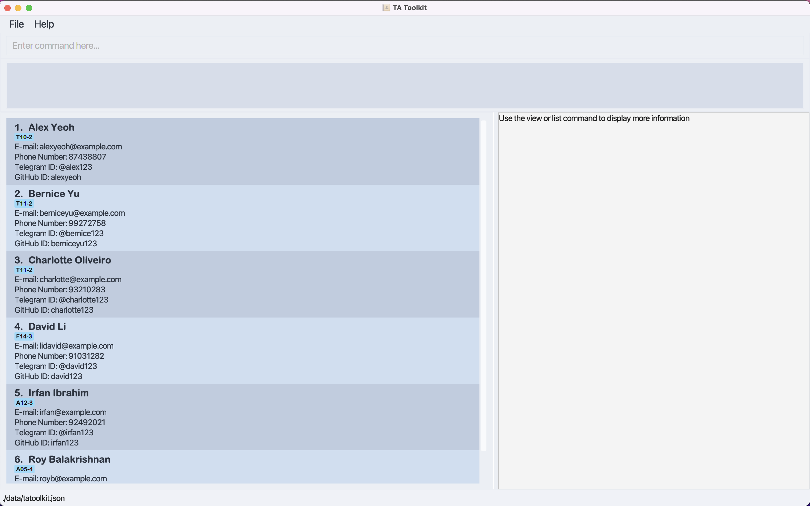
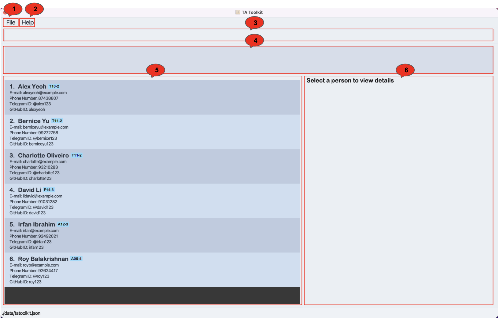
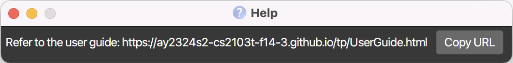
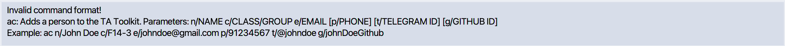
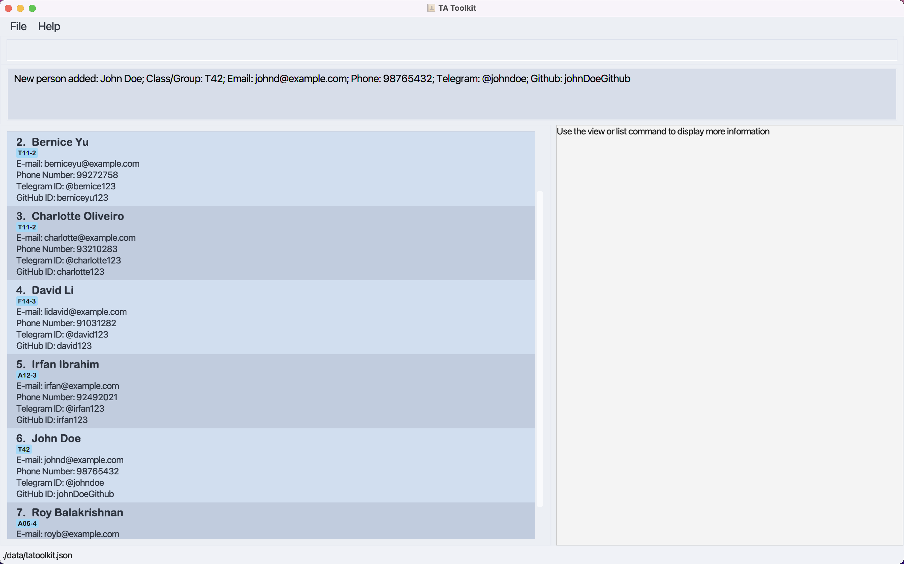
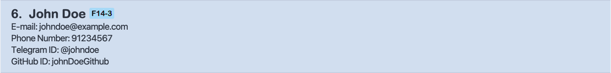
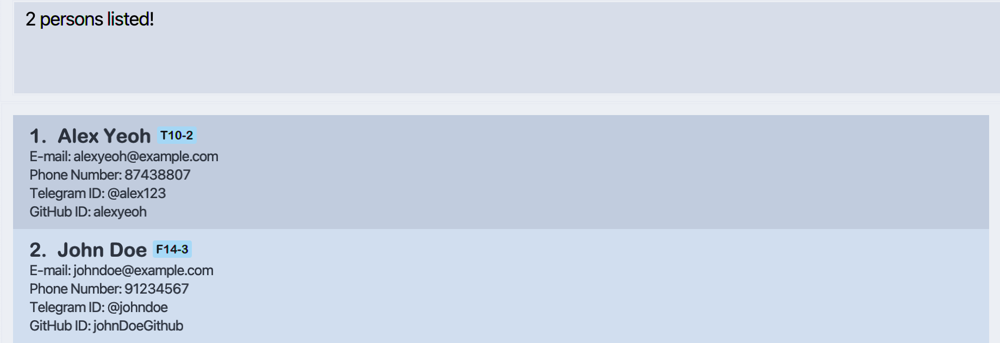
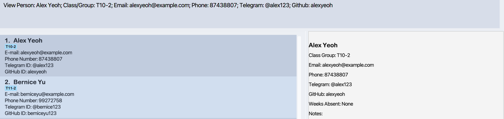
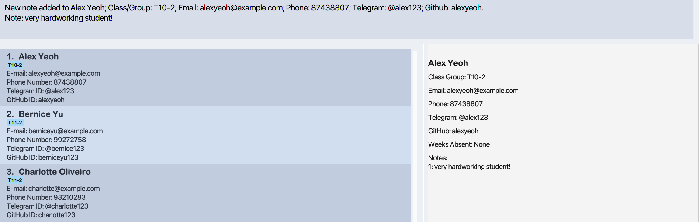

# TA Toolkit User Guide

TA Toolkit is a desktop application designed to help CS2100 Teaching Assistants (TAs) from the School of Computing (SoC) at the National University of Singapore (NUS)
efficiently manage the contacts of their students. This User Guide assumes that you are familiar with the Command Line Interface (CLI)
applications and are a fast typist, allowing you to get your student management tasks done faster than traditional Graphical User Interface (GUI) apps.

Juggling teaching and administrative tasks, time is a precious resource for CS2100 TAs and effective contact management is crucial.
TA Toolkit is meticulously designed to cater to your administrative requirements, guaranteeing seamless handling of
your contact-related duties. It offers a rapid and user-friendly solution via a Command Line Interface (CLI), specifically
tailored to enhance the efficiency and effectiveness of your contact management endeavours.

Below are some ways to integrate TA Toolkit into your workflow:

- You can categorise student contacts into the different class groups that you teach.
- You can filter student contacts easily based on their name or class group.
- You can track the attendance of your students easily.
- You can take notes on individual students to personalise your teaching.

<box type="info" seamless>

**Tip:** If this is your first time using TA Toolkit, head over to [How to use TA Toolkit's User Guide](#how-to-use)
to start keeping track of all your students' contacts!

</box>

--------------------------------------------------------------------------------------------------------------------

<!-- * Table of Contents -->
<page-nav-print />

--------------------------------------------------------------------------------------------------------------------

## How to Use

Welcome to TA Toolkit. We are confident that TA Toolkit will become your reliable ally throughout your journey as a CS2100 TA.
This user guide offers you detailed documentation of TA Toolkit's capabilities.

If this is your first encounter with TA Toolkit, ensure that the application has been downloaded.
Please proceed to [Quick Start](#quick-start) for instructions on installing the application.

If you would like to have a brief introduction to the application's interface,
head over to our [Interface Walkthrough](#interface-walkthrough) to better learn about TA Toolkit.

If you are already familiar with TA Toolkit, you can refer to [Command Summary](#command-summary) for a
summary of all the commands in TA Toolkit.

If you encounter any issues with the commands or find yourself uncertain about anything,
feel free to explore the [Glossary](#Glossary) for explanations on technical terms,
consult the [FAQ](#faq) for answers to common questions,
or explore [Common Mistakes](#common-mistakes) for typical errors that users may encounter while utilising the application.

--------------------------------------------------------------------------------------------------------------------

## Labels

In our user guide, you may find coloured labels that contain text nuggets.

<box type="info" seamless>

Blue labels represent helpful tips to enhance your experience.

</box>

<box type="warning" seamless>

Yellow labels represent warnings that you should be cautious about.

</box>

--------------------------------------------------------------------------------------------------------------------

## Key Terms

TA Toolkit stores students' contact details and allows the user to take notes on students and track their attendance.
As such, it is important that you familiarise yourself with the structure of each person as well as their key attributes (notes, attendance).

### Person

A person represents your student. At the start of the teaching semester, you should add your students' basic contact details (NAME, CLASS_GROUP, EMAIL).

A person has the following attributes:
- Name (Compulsory)
- Class_Group (Compulsory)
- Email address (Compulsory)
- Phone number (Optional)
- Telegram handle (Optional)
- GitHub ID (Optional)
- Attendance (Tracked by the application)
- Notes (Tracked by the application)

In TA Toolkit, duplicating entries with identical email addresses, phone numbers, Telegram handles, or GitHub IDs is not supported. The comparison of these fields for equality is case-insensitive. Therefore, you cannot add multiple individuals sharing the same email, phone number, Telegram handle, or GitHub ID.

<box type="info" seamless>

**Tip:**
After adding a student's contact, update their phone number, Telegram handle, and GitHub ID as and when you receive the necessary information.

</box>

### Attendance

Each student has an attendance for each week tied to them. Since NUS semesters contain 13 weeks, TA Toolkit only supports taking attendance for 13 weeks.
When a student contact is added to TA Toolkit, he is assumed to be present for all 13 weeks.
You can use the [`ma`](#marking-attendance-ma) command to mark a student as present or absent for a specific week.

<box type="info" seamless>

**Tip:**
Use negative marking to quickly take attendance for a class. Since all students are initially assumed to be present,
you can quickly mark the attendance of an entire class by only marking the absentees as absent.

</box>

--------------------------------------------------------------------------------------------------------------------

## Quick start

1. Ensure you have Java `11` or above installed on your computer.

To install Java on a Windows computer, click [here](https://www.java.com/en/download/help/windows_manual_download.html).

To install Java that is compatible with our application on a Mac computer, download and install the Azul build of OpenJDK 11 version found [here](https://www.azul.com/downloads/?version=java-11-lts&os=macos&architecture=arm-64-bit&package=jdk-fx) and ensure to choose the JDK FXversion.

To install Java on a Linux computer, click [here](https://www.java.com/en/download/help/linux_x64_install.html).

To check the version of Java installed on your computer, click [here](https://www.java.com/en/download/help/version_manual.html) if you are using a Windows or Mac computer, and click [here](https://phoenixnap.com/kb/check-java-version-linux)
if your computer is running Linux.

2. Download the latest `TAToolkit.jar` from [here](https://github.com/AY2324S2-CS2103T-F14-3/tp/releases).

3. Copy the file to the folder you want to use as the _home folder_ for your TA Toolkit.

4. Open a command terminal, `cd` into the folder you put the jar file in, and use the `java -jar TAToolkit.jar` command to run the application. 
   A GUI similar to the one below should appear in a few seconds. Note how the app contains some sample data. 
   

5. Type the command in the command box and press Enter to execute it. e.g. typing **`help`** and pressing Enter will open the help window. 
   Some example commands you can try:

   * `ls` : Lists all contacts.

   * `ac n/John Doe c/T42 p/98765432 e/johnd@example.com t/@johndoe g/johnDoeGithub` : Adds a student named `John Doe` to the TA Toolkit.

   * `dc 3` : Deletes the 3rd contact shown in the current list.

   * `clear` : Deletes all contacts.

   * `exit` : Exits the app.

6. Refer to the [Features](#features) below for details of each command.

--------------------------------------------------------------------------------------------------------------------

## Interface walkthrough

This is the expected interface of the GUI when you launch TA Toolkit. Please note that this application has been populated with sample data.

The key windows are labelled as follows:

1. File button: Opens an option to exit the application.
2. Help button: Opens a menu with a link to the User Guide.
3. Command Box: Enter your command here.
4. Result Display: Displays the result of your command.
5. Displayed Person List: Displays a list of persons' contacts and their contact information.
6. Side Panel Display: Displays detailed information on a specific person or the attendance overview.

The "Help" window will look like as follows:

--------------------------------------------------------------------------------------------------------------------

## Parameters

Some of TA Toolkit's commands require parameters, which have specific formats. Before heading to the [Features](#features) section, we recommend taking a look at the type of parameters and their constraints.

The following parameters are used for commands:

| Parameter     | Prefix | Format                                                                                                                                                                                                                    | Example                                         |
|---------------|--------|---------------------------------------------------------------------------------------------------------------------------------------------------------------------------------------------------------------------------|-------------------------------------------------|
| INDEX         | -      | Positive integers only                                                                                                                                                                                                    | `1`, `2`, `3`                                   |
| KEYWORD       | -      | Alphanumeric only                                                                                                                                                                                                         | `Alex`, `Bernice`                               |
| NAME          | n/     | Alphanumeric, can contain multiple words                                                                                                                                                                                  | `Alex Yeoh`, `Bernice Yu`                       |
| PHONE_NUMBER  | p/     | Numeric, minimum length of 3 digits. Users are responsible for ensuring the phone number is valid.                                                                                                                        | `99999999`, `88888888`                          |
| TELEGRAM      | t/     | Starts with @, followed by alphanumeric characters or underscores. Users are responsible for ensuring their Telegram ID is valid.                                                                                         | `@nus_cs2100` , `@johnDoe`                      |
| EMAIL         | e/     | A local-part (consisting of letters, numbers, underscores, dots, and dashes), followed by the '@' symbol, then the domain name with at least 2 characters. Users are responsible for ensuring the email address is valid. | `damithch@comp.nus.edu.sg`, `dcsdcr@nus.edu.sg` |
| GITHUB        | g/     | Consists of alphanumeric characters, underscores, periods, and hyphens. Users are responsible for ensuring GitHub ID is valid.                                                                                            | `johnDoe`, `alice-yu`                           |
| CLASS_GROUP   | c/     | Consists of alphanumeric characters                                                                                                                                                                                       | `T10`, `T42`                                    |
| NOTE          | note/  | Consists of alphanumeric characters and basic punctuation (periods, commas, exclamation marks, question marks)                                                                                                            | `Proficient in Java!`, `Beginner to Python.`    |
| NOTE_INDEX    | i/     | Positive integers only                                                                                                                                                                                                    | `1`, `2`, `3`                                   |
| WEEK          | w/     | Positive integers from 1 - 13 only                                                                                                                                                                                        | `1`, `2`, `3`                                   |
| PRESENT_INDEX | pre/   | Positive integers only                                                                                                                                                                                                    | `1`, `2`, `3`                                   |
| ABSENT_INDEX  | abs/   | Positive integers only                                                                                                                                                                                                    | `1`, `2`, `3`                                   |

--------------------------------------------------------------------------------------------------------------------

## Features

<box type="info" seamless>

**Notes about the command format:** 

* Commands are case-sensitive.

* Words in `UPPER_CASE` are the parameters to be supplied by the user. 
  e.g. in `ac n/NAME`, `NAME` is a parameter which can be used as `ac n/John Doe`.

* Items in square brackets are optional. If an optional prefix is used without a value, it is assumed that you are creating a user without the value or deleting the already existing value. 
  e.g. `n/NAME [t/TELEGRAM]` can be used as `n/John Doe t/@johndoe` or as `n/John Doe`, or also as `n/John Doe t/`.

* Parameters can be in any order. 
  e.g. if the command specifies `n/NAME p/PHONE_NUMBER`, `p/PHONE_NUMBER n/NAME` is also acceptable.

* Items with … after them can be used multiple times (1 or more). 
  For example, the `ls CLASS_GROUP` command can be used to search 1 `CLASS_GROUP` like `ls T10`, or 2 `CLASS_GROUP`s like `ls T10 T20`.

* Extraneous parameters for commands that do not take in parameters (such as `help`, `ls`, `exit` and `clear`) will be ignored. 
  e.g. if the command specifies `help 123`, it will be interpreted as `help`.

* For any command that fails to execute, refer to the Result Display, which will provide a helpful explanation to help you correct your command.
  

* If any extra parameters with an invalid prefix are provided, the command will consider that prefix and parameter as part of the previous parameter. 
  e.g. if the command specifies `ac n/John Doe c/T42 p/98765432 homework/Lab 4`, the command will interpret `homework/Lab 4` as part of the `PHONE_NUMBER` parameter, as `homework` is not a valid prefix for the `ac` command.

* If you are using a PDF version of this document, be careful when copying and pasting commands that span multiple lines as space characters surrounding line-breaks may be omitted when copied over to the application.
</box>

### Viewing help : `help`

This opens a window containing a link to the User Guide.

Format: `help`

### Adding a person: `ac`

This helps you to add a person to TA Toolkit.

Format: `ac n/NAME c/CLASS_GROUP e/EMAIL [p/PHONE_NUMBER] [t/TELEGRAM] [g/GITHUB]`

* When adding a contact, the contact's EMAIL, PHONE_NUMBER, TELEGRAM, and GITHUB must be unique compared to every other person in TA Toolkit.

Examples:
* `ac n/John Doe c/T42 p/98765432 e/johnd@example.com t/@johndoe g/johnDoeGithub` This adds a new member named `John Doe` with class_group `T42`, phone number `98765432`, email `johnd@example.com`, Telegram
handle `@johndoe` and GitHub `johnDoeGithub` to the list of contacts.

### Updating a person : `uc`

This helps you to update the contact details of an existing person in TA Toolkit.

Format: `uc INDEX [n/NAME] [c/CLASS_GROUP] [e/EMAIL] [p/PHONE_NUMBER] [t/TELEGRAM] [g/GITHUB]`

* Updates the person at the specified `INDEX`. The index refers to the index number shown in the displayed person list. The index **must be a positive integer** 1, 2, 3, …​
* At least one of the optional fields must be provided.
* Existing values will be updated to the input values.
* The updated person must have a different field compared to the original person.
* When updating any field, `EMAIL`, `PHONE_NUMBER`, `TELEGRAM`, and `GITHUB` must be unique compared to every other person.

Examples:
*  `uc 2 n/Betsy Crower t/` Edits the name of the 2nd person to be `Betsy Crower` and clears the Telegram field.
*  `uc 6 p/91234567 e/johndoe@example.com` Edits the phone number and email address of the 6th person to be `91234567` and `johndoe@example.com` respectively.

### Locating persons by name: `find`

This helps you find specific persons by their names.

Format: `find KEYWORD [KEYWORD...]`

* The search is case-insensitive. e.g. `hans` will match `Hans`
* The order of the keywords does not matter. e.g. `Hans Bo` will match `Bo Hans`
* Only the name is searched.
* Only full words will be matched e.g. `Han` will not match `Hans`
* Persons matching at least one keyword will be returned (i.e. `OR` search).
  e.g. `Hans Bo` will return `Hans Gruber`, `Bo Yang`

Examples:
* `find alex john` returns `Alex Yeoh`, `John Doe` 
  

### Listing persons : `ls`

This shows you a list of all persons in TA Toolkit based on a CLASS_GROUP in the Contact List Display.
Also, the attendance overview of all persons in the displayed person list will be displayed in the side panel display.

Format: `ls [CLASS_GROUP...]`

* If no parameters are provided, all persons in the TA Toolkit will be displayed.
* For a given parameter, all persons with a CLASS_GROUP beginning with the parameter will be displayed.
* The CLASS_GROUP parameter is case-sensitive.

Examples:
* `ls` Displays all persons in the TA Toolkit.
* `ls T4` Displays all person with a CLASS_GROUP beginning with T4, e.g. T40, T42, etc.

<box type="info" seamless>

**Tip:** If you try to list the students for a specific class, but nothing is displayed, check that the CLASS_GROUP
parameter has the correct letter casing.

</box>

### Viewing a person : `view`

This helps you to view the detailed information of a specified person on the side panel display.

Format: `view INDEX`

* View the person at the specified `INDEX`.
* The person's details will be displayed on the side panel display.
* `INDEX` refers to the index number shown in the displayed person list.
* `INDEX` **must be a positive integer** 1, 2, 3, …​

Examples:
* `view 1` views the first person of the displayed person list on the side panel display.

  

### Adding a note to a person : `an`

This helps you to add notes to a specified person in TA Toolkit.

Format: `an INDEX note/NOTE`

* `INDEX` refers to the index number shown in the displayed person list.
* `INDEX` **must be a positive integer** 1, 2, 3, …​
* `NOTE` **must contain only alphanumeric characters and basic punctuation (periods, commas, exclamation marks, question marks) ** hardworking, sleepy, …​

Examples:
* `an 1 note/very hardworking student!` adds a note of `very hardworking student!` to the first person in the TA Toolkit.

  

### Deleting a note from a person : `dn`

Delete a note from a specified index of a specified person from the TA Toolkit.

Format: `dn INDEX i/NOTE_INDEX...`

* `INDEX` refers to the index number shown in the displayed person list.
* `NOTEINDEX` refers to the index of the note within a person.
* `INDEX` and `NOTEINDEX` **must be a positive integer** 1, 2, 3, …​
* If multiple indices are provided, they should be comma-separated.

Examples:
* `dn 1 i/2` deletes the second note from the first person in the TA Toolkit.

### Marking attendance : `ma`

Marks the attendance of a student as absent or present.

Format: `ma w/WEEK [pre/PRESENT_INDEX...] [abs/ABSENT_INDEX...]`

* Person indices under `pre/` will be marked as present. Person indices under `abs/` will be marked as absent.
* When a person contact is created, he will be assumed to be present for all weeks.
* This command will overwrite the existing attendance for the students.
* No duplicate indices are allowed in `PRESENT_INDEX` and `ABSENT_INDEX`.
* If multiple indices are provided, they should be comma-separated.
* At least one optional parameter must be present in the command.

Examples:
* `ma w/1 abs/1,2` marks the first and second persons in the displayed persons list as absent.
  

<box type="info" seamless>

**Tip:** To quickly mark attendance of the class for the week, use the [ls](#listing-persons-ls) command to list all students in the class.
Then, mark the absentees for the week as absent. Since all students are initially assumed to be present, only the absentees will be marked as absent.

</box>

### Deleting a person : `dc`

Deletes a specified person from the TA Toolkit.

Format: `dc INDEX`

* Deletes the person at the specified `INDEX`.
* The index refers to the index number shown in the displayed person list.
* The index **must be a positive integer** 1, 2, 3, …​

Examples:
* `dc 2` deletes the 2nd person in the displayed person list.

<box type="warning" seamless>

**Caution:** There is no prompt to confirm this action. This command is not reversible. Deleted contacts will have to be
re-added to the list of students via the [`ac`](#adding-a-person-ac) command.

</box>

### Clearing all entries : `clear`

Clears all entries from the TA Toolkit.

Format: `clear`

<box type="warning" seamless>

**Caution:** There is no prompt to confirm this action. You are advised to save a backup of the data as this
action will **not be reversible**.

</box>

### Exiting the program : `exit`

Exits the program.

Format: `exit`

### Saving the data

TAToolkit data are saved in the hard disk automatically after any command that changes the data. There is no need to save manually.

### Editing the data file

TAToolkit data are saved automatically as a JSON file `[JAR file location]/data/TAToolkit.json`. Advanced users are welcome to update data directly by editing that data file.

<box type="warning" seamless>

**Caution:**
If your changes to the data file make its format invalid, TAToolkit will discard all data and start with an empty data file at the next run. Note that after discarding all data, TaToolkit will clear the data file only if the application is exited using the `exit` command. Hence, it is recommended to take a backup of the file before editing it. 
Furthermore, certain edits can cause the TAToolkit to behave in unexpected ways (e.g. if a value entered is outside the acceptable range). Therefore, edit the data file only if you are confident that you can update it correctly.
</box>

### Archiving data files `[coming in v2.0]`

_Details coming soon ..._

--------------------------------------------------------------------------------------------------------------------

## FAQ

**Q**: How do I see the attendance or notes of a specific student? 
**A**: You have to use the [`view`](#viewing-a-person-view) command to view the detailed information containing the notes and attendance of the person.
For example, if you want to view the attendance of the first person in the displayed person list, use the `view 1` command to view their detailed information.

**Q**: How do I see the overall attendance for a specific class? 
**A**: You have to use the [`ls`](#listing-persons-ls) command to list all the persons for a specific class.
The overall attendance of the class will be displayed in the side panel display.

**Q**: Why can't I see the application even though it is open? 
**A**: When using multiple screens, if you move the application to a secondary screen,
and later switch to using only the primary screen, the GUI will open off-screen.
The remedy is to delete the `preferences.json` file created by the application before running the application again.

**Q**: How do I transfer my data to another Computer? 
**A**: Install the app on the other computer and overwrite the empty data file it creates with the file that contains
the data of your previous TAToolkit home folder.

<box type="info" seamless>

**Caution:**
If the tatoolkit.json file is invalid or has any formatting errors, the program might not start up. Please make sure
that the tatoolkit.json file used is **correct and accurate.**

</box>

--------------------------------------------------------------------------------------------------------------------

## Common mistakes

1. **When [adding contacts](#adding-a-person-ac) or [updating contacts](#updating-a-person-uc)**,
if the command causes 2 persons in the TA Toolkit to have the same `EMAIL`, `PHONE_NUMBER`, `TELEGRAM`, or `GITHUB`,
the command will fail. This is because every contact should have a unique `EMAIL`, `PHONE_NUMBER`, `TELEGRAM`, and `GITHUB`.

2. **When [updating contacts](#updating-a-person-uc), [deleting contacts](#deleting-a-person-dc)**,
i.e. any commands that utilise the `INDEX` parameter, the command is interacting with the wrong contact.
The `INDEX` must match the current index of the person on the displayed person list. Should you find yourself updating/ deleting the wrong person,
ensure you adhere to the index presently shown, rather than an index from a past view.

To reset the displayed person list, you can refer to the [`ls`](#listing-persons-ls) command.

--------------------------------------------------------------------------------------------------------------------

## Command summary

| Action                                             | Format, Examples                                                                                                                                                      |
|----------------------------------------------------|-----------------------------------------------------------------------------------------------------------------------------------------------------------------------|
| [**Add**](#adding-a-person-ac)                     | `ac n/NAME c/CLASS_GROUP e/EMAIL p/PHONE_NUMBER [t/TELEGRAM] [g/GITHUB]`   e.g., `ac c/T42 n/James Ho p/22224444 e/jamesho@example.com t/@jamesho g/jameshoGithub` |
| [**Add Note**](#adding-note-to-a-person-an)        | `an INDEX note/NOTE`   e.g., `an 1 note/Very interested in Assembly`                                                                                               |
| [**Clear**](#clearing-all-entries-clear)           | `clear`                                                                                                                                                               |
| [**Delete**](#deleting-a-person-dc)                | `dc INDEX`  e.g., `dc 3`                                                                                                                                           |
| [**Delete Note**](#deleting-note-from-a-person-dn) | `dn INDEX i/NOTEINDEX...`  e.g., `dn 1 i/1,2`                                                                                                                      |
| [**Find**](#locating-persons-by-name-find)         | `find KEYWORD...`  e.g., `find James Jake`                                                                                                                         |
| [**Help**](#viewing-help-help)                     | `help`                                                                                                                                                                |
| [**List**](#listing-persons-ls)                    | `ls [CLASS_GROUP...]`   e.g., `ls T42`                                                                                                                             |
| [**Mark Attendance**](#marking-attendance-ma)      | `ma w/WEEK [pre/PRESENT_INDEX] [abs/ABSENT_INDEX]`   e.g.,`ma w/1 pre/1,2 abs/3`                                                                                   |
| [**Update**](#updating-a-person-uc)                | `uc INDEX [n/NAME] [c/CLASS_GROUP] [e/EMAIL] [p/PHONE_NUMBER] [t/TELEGRAM] [g/GITHUB]`   e.g.,`uc 2 n/James Lee e/jameslee@example.com`                            |
| [**View**](#viewing-a-person-view)                 | `view INDEX`                                                                                                                                                          |

--------------------------------------------------------------------------------------------------------------------

## Glossary

* **Absent**: An attendance status to indicate that a student did not attend a class.
* **Alphanumeric**: A String consisting of only letters (a-z, A-Z) or numbers or both.
* **Command**: Commands are necessary to use TA Toolkit. A command has to be typed into the Command Box and entered to be executed.
* **Command terminal**: A command terminal is a text-based interface through which users can interact with a computer program by typing commands.
* **CLI**: Command Line Interface: A way of interacting with a computer program where the user issues commands to the
  program in the form of successive lines of text (command lines). It emphasises text-based user interaction over graphical user interfaces.
* **Email**: A unique identifier for an email account.
* **Index**: A number representing the position of an item in a list.
* **GitHub ID**: A unique identifier for a GitHub account. E.g. johnDoe
* **GUI**: Graphical User Interface: A mode of interacting with a computer program that relies on visual elements such as windows, icons, buttons, and menus.
* **Hard disk**: A component of a computer system responsible for long-term storage of data.
* **JSON file**: A JSON (JavaScript Object Notation) file is a structured data file format used for storing and transmitting data between the hard disk and TA Toolkit.
* **Note**: A String that can be associated with a person to provide additional details about them.
* **Phone number**: A sequence of digits that is dialled on a telephone to contact a person.
* **Present**: An attendance status to indicate that a student attended a class.
* **TA**: Teaching Assistant
* **Telegram handle**: A unique identifier for a Telegram account. E.g. @johnDoe
